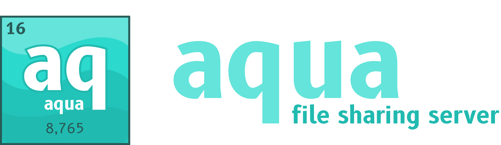

# aqua



---

**aqua** is a simple file uploading and sharing server for personal use. It is built to be easy to set up and host on your own server, for example to use it in combination with
uploading tools like [ShareX](https://getsharex.com/).

It is the successor/rework of my previous project [lightf](https://github.com/Superioz/lightf), but this time without trying weird things out and building a complete product instead.

# Installation

There are as always multiple ways to install the server. The recommended way is to use Docker Compose or deploy it to Kubernetes, but we start with the manual way.

## Manually

This is only for those people, that are still living in the 90s or are not comfortable with a Docker installation.

1. First download the specific binary from the [releases](https://github.com/Superioz/aqua/releases) and put it somewhere (e.g. with `wget` on Linux). Also, add execution permission
   with `chmod +x aq-linux-amd64`.
2. Do the configuration you want (e.g. setting environment variables and creating an `auth.yml`). See [Configuration](#configuration)
3. Execute the downloaded binary and don't forget to open port `8765` on your machine/server.

For further instructions like creating a service that can easily be started with `service aqua start`, please refer to other pages (there are a bunch that explain this) - I won't.

## Docker Compose

Before following the steps, make sure you have [Docker](https://docs.docker.com/get-docker/) and [Docker Compose](https://docs.docker.com/compose/install/) installed on the machine.

1. Clone the repository to a directory of your liking with `git clone git@github.com:Superioz/aqua.git`
2. Edit the `auth.yml` with your custom auth tokens and settings.
3. Rename the `.env.dist` to `.env` and edit it as well.
4. `docker-compose up` and you should see it up and running.

## Kubernetes

TBD

# Configuration

## Environment Variables

For examplary usage of the environment variables, have a look at the `.env.dist` file in the root directory of the repository.

| Variable | Description |
| -------- | ----------- |
| `AUTH_CONFIG_PATH` | Path to the `auth.yml` config file. |
| `FILE_STORAGE_PATH` | Path to the directory, where the files should be stored. |
| `FILE_NAME_LENGTH` | Length of the file names, that should be randomly generated. Should be long enough to make guessing impossible. |
| `FILE_META_DB_PATH` | Path to the directory, where the sqlite database for file metadata should be stored. Recommended to not be the same folder as `FILE_STORAGE_PATH` to prevent overlapping. |
| `FILE_EXPIRATION_CYCLE` | Determines the interval of the expiration cycle. `5` means that every 5 seconds the files will be checked for expiration.  |

## Tokens

Inside the `auth.yml` file you can configure which tokens are valid and for what file types they can be used for. An example file could look like this:

```yaml
validTokens:
  - token: 71a4c056ab9b0fb965063344cd6616bc
    fileTypes:
      - image/png
      - image/jpeg
```

Each token is an element of the `validTokens` list and can be generated however you want. It is not even necessary for it to be hexadecimal, it can be any kind of string you want (
e.g. `my_favorite_password` or something like `X_!]6rk[wC]%7aN^fB>#PzuFd{L,ugsq`).

But if you want to keep it simple, you can use the `aq` CLI tool to generate it directly like so:

```console
user@host:~$ aq generate --length 32
L1dLUm12!Lb%7Nz1ep4h5Vo+Fn531&EU
```

After adding the token to the list you may want to restrict what files can be uploaded with that token. That can be done with the `fileTypes` field. If you leave it empty, all file
types are possible, otherwise only the configured ones.

Normally we would accept every possible MIME type, but as they behave completely different sometimes and we want to keep it simple, we **only support** the following ones:

```
application/pdf
application/json
image/png
image/jpeg
text/csv
text/plain
```

# CLI Tool

Installing the CLI tool is fairly simple. Just download the respective binary from [releases](https://github.com/Superioz/aqua/releases), rename it and put it somewhere in your `$PATH`.
Don't forget to add execution permissions `chmod +x aq`.

Now to upload a local file, you just have to execute the following command:

```sh
aq upload --host https://my-domain.com:8765 --token my_token local_file.png
```

To upload multiple files at the same time, just do it like this:

```sh
aq upload --host https://my-domain.com:8765 --token my_token local_file1.png local_file2.txt [...]
```
